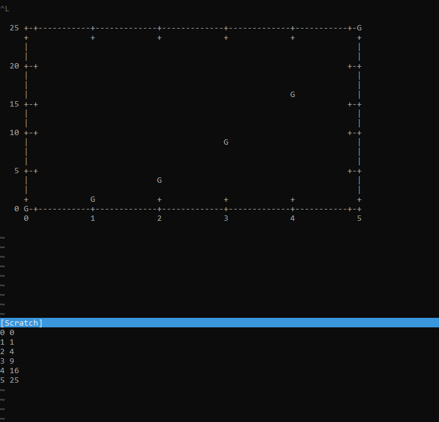

# vim-graphs

Generate ascii graphs using gnuplot

## Requirements

It is intended to run on Unix/Linux shells with gnuplot installed.

## Installation

Using [vim-plug](https://github.com/junegunn/vim-plug):

```vim
Plug 'bilbopingouin/vim-graphs'
```

## Usage

Select some data visually


Generate the graph using 

```vim
<leader>cg
```

And the graph will appear in a scratch window


